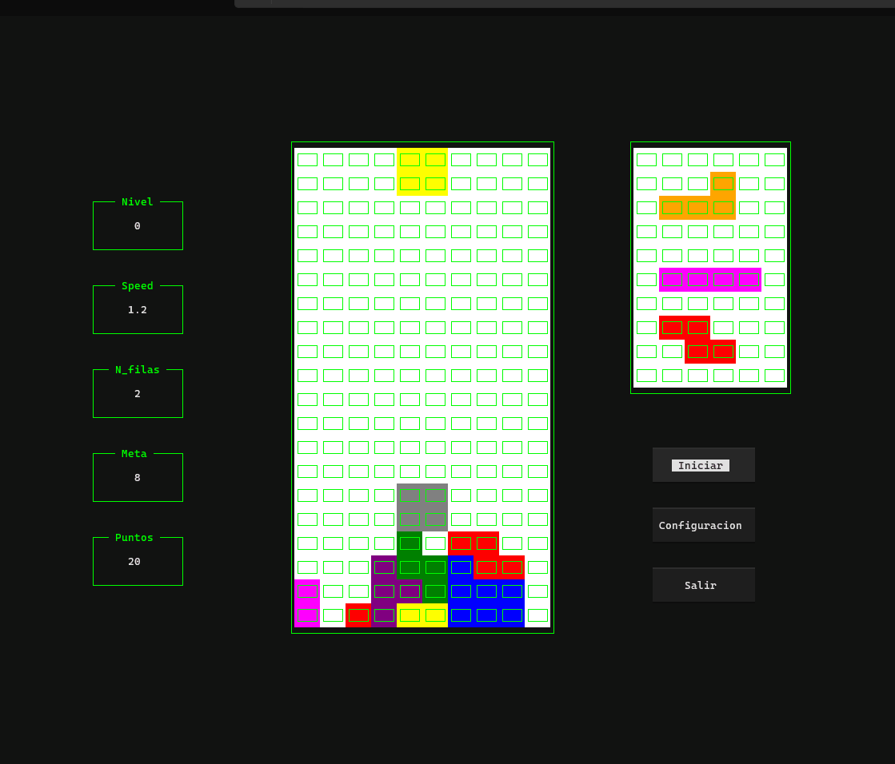

# Tetris en Python con Textual

Este es un proyecto de Tetris desarrollado en Python usando la libreria de aplicaciones en terminal Textual

## 📥 Clonar el repositorio

Para clonar el repositorio en tu máquina local, ejecuta el siguiente comando en tu terminal:

```sh
 git clone https://github.com/Paul-Asto/Game-Tetris-in-Python-Textual.git
 cd Game-Tetris-in-Python-Textual
```

## 🛠️ Crear y activar un entorno virtual

Es recomendable utilizar un entorno virtual para gestionar las dependencias del proyecto.

### 🔹 En Windows (CMD o PowerShell)
```sh
python -m venv venv
venv\Scripts\activate
```

### 🔹 En macOS y Linux
```sh
python3 -m venv venv
source venv/bin/activate
```

## 📦 Instalar dependencias

Una vez activado el entorno virtual, instala las dependencias del archivo `requirements_dev.txt` con:

```sh
pip install -r requirements_dev.txt
```

## 📜 Dependencias del proyecto

Este proyecto usa la siguiente librería:

```
textual
```

## 🚀 Ejecutar el proyecto

Para ejecutar el juego, simplemente corre:

```sh
python main.py
```

¡Disfruta jugando mi version de Tetris! 




# 🎮 Controles del Teclado - Tetris

En este documento se explican los eventos del teclado utilizados en el juego de Tetris.

## 🕹 Controles

| Tecla        | Acción |
|-------------|------------------------------------------------|
| ⬆️ (Arriba) | Rotar la pieza en sentido horario. |
| ⬇️ (Abajo)  | Mover la pieza hacia abajo. |
| ⬅️ (Izquierda) | Mover la pieza a la izquierda. |
| ➡️ (Derecha) | Mover la pieza a la derecha. |
| Space (Espacio) | "Matar" la pieza, es decir, hacer que caiga instantáneamente hasta la posición más baja posible. |

